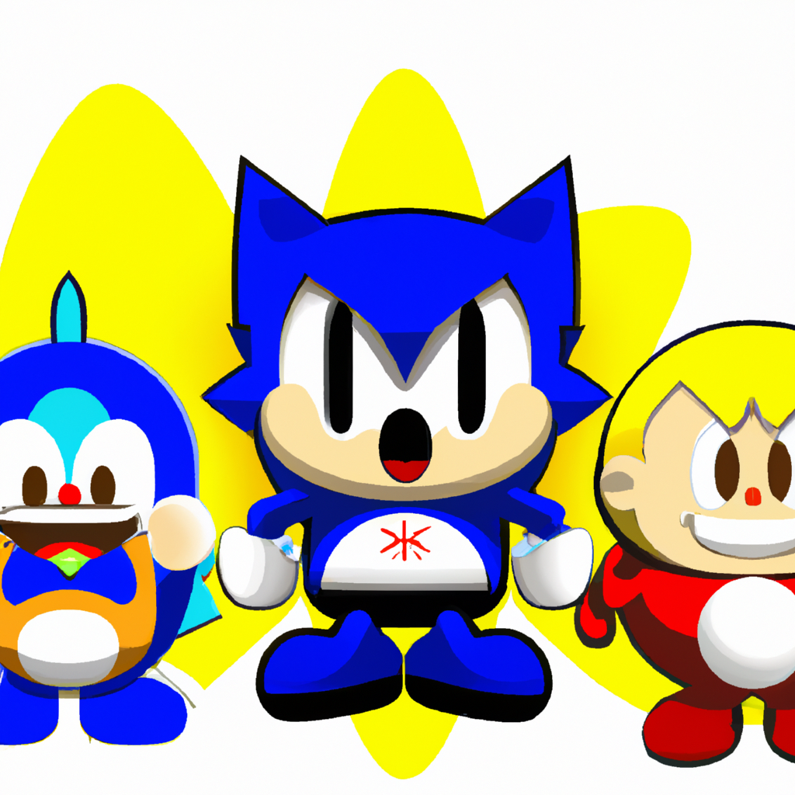
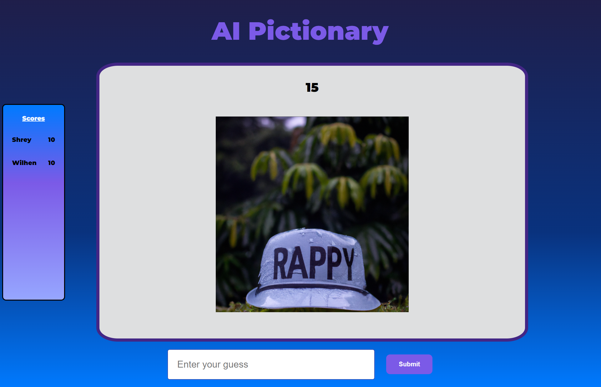
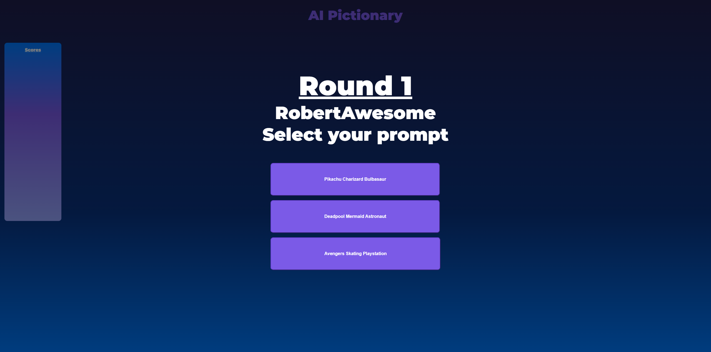
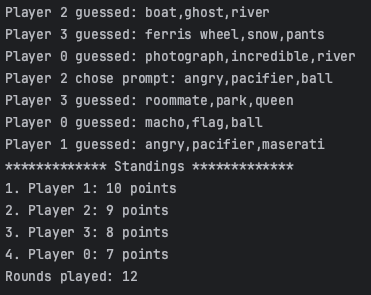

# AI Pictionary

# Description
Can you guess the following picture with three words?

  

I tried Sonic, Penguin, and Kid, but I was partially right. It's Sonic, Pokemon, and Dragon Ball. 

Interesting. Anyway... we're introducing AI Pictionary!

AI Pictionary is a 4-6 player game played with an AI art generator, where players attempt to guess from the displayed image and take turns being the prompter in a rotating fashion within a fixed circle of players. Each round lasts 60 seconds. Each turn, the game generates 3 random prompts from an internal limited dictionary. One prompt represents a sequence of 3 words used to generate an image (e.g., "Big" "Ocean" "Ship").

Using an AI art generator, the chosen prompt is transformed into an image, and the guessers must guess the prompt. All guesses are validated to conform the dictionary and must consist of 3 words. The prompter sees all guesses, while the guessers only see their own submissions. The original prompt, all guesses, and updated scores are revealed after all players submit their guesses.

In terms of scores, for each word correctly guessed, the player will receive 1 point. More specifically, if player guessed only 1 word correctly, then they will receive 1 point. If the player guessed 2 words correctly, then they will receive 2 points. Finally, if the player guessed all 3 words correctly, then they will receive 3 points. The order of the words doesn't matter, as long as they have matching words.

There are (3 * total players) number of rounds, and the player with the most points at the end will win the game. The game allows multiple winners in the case that there are ties.

# Visuals
This is how it would look like in a live-gameplay, with current scores of players.

## Guesser:

  

## Prompter:

  

# Installation
## On website 
### (Note: currently, there's no connection to the webserver and AI Pictionary is not complete):
1. Access the link: https://cs410.online/
2. Type in your name
3. In "Game", select AI Pictionary 
4. You have two choices, create a private game to play with your friends or to join a game that is waiting for more players.
5. If you want to create your private game, select the number of players that you want to play with. With that, you can click on "Start Game" and provide the code displayed on the screen to your friends!
6. If you want to join a game, type in your name once again and type in the "Game ID", or the code, that the host should've received when they created the private game.
7. Once the rooms are filled, you will be redirected to AI Pictionary and you are ready to play!

## On an IDE:
1. Open the command-line argument on your computer
2. Type the following: 
    
    git clone "https://gitlab.com/cs410f23/ai-pictionary.git"

3. Open the folder "ai-pictionary" on the editor of your choice (VSCode, IntelliJ, etc.)
4. To the left, you will see some folders, where you will click the following folders: AIPictionary/src/main/java/cs410/aipictionary/model/. At this point, access Main.java.
5. Click on the green arrow to compile and run, and you got yourself a simulation of how the game works.

This is how it would look like (a sample):

  

# Usage
As a prompter, you're given three buttons representing the prompts to choose from. You may click once on any of them and that would be your selection for the guessers to guess. As a guesser, once the prompt is out and the time is ticking, the guessers have one attempt to provide a sequence of three words and they must wait until the rest of players have submitted their guesses on the input text. Once the round is over, the prompter role is given to the next one in line, and the game goes on until the game ends.

# Roadmap
For improvements, we'd like to get the front-end and back-end connected, by having the front-end fetch POST and GET requests from the back-end, and the back-end to provide the necessary updates. We also would like to add the implementation of the prompter to generate 3 more random prompts in case the prompter is not satisfied with the given prompts. In terms of complexity, we'd like to develop this project using another framework such as node.js, or possibly learn more about Spring Boot, as it is easy to use.

# Authors and acknowledgment
Special thanks to Zion Chilagan, Shrey Patel, Brendan Nguyen, and Wilhen Alberto Hui Mei for participating in this software engineering project, as we all learned how the MVC model works, how the front-end and back-end communicate, and many more. Thanks to Professor Ryan Culpepper for providing us the prompt and the game for the final project for CS410 - Software Engineering. We also used EdenAI for the AI art generator.
